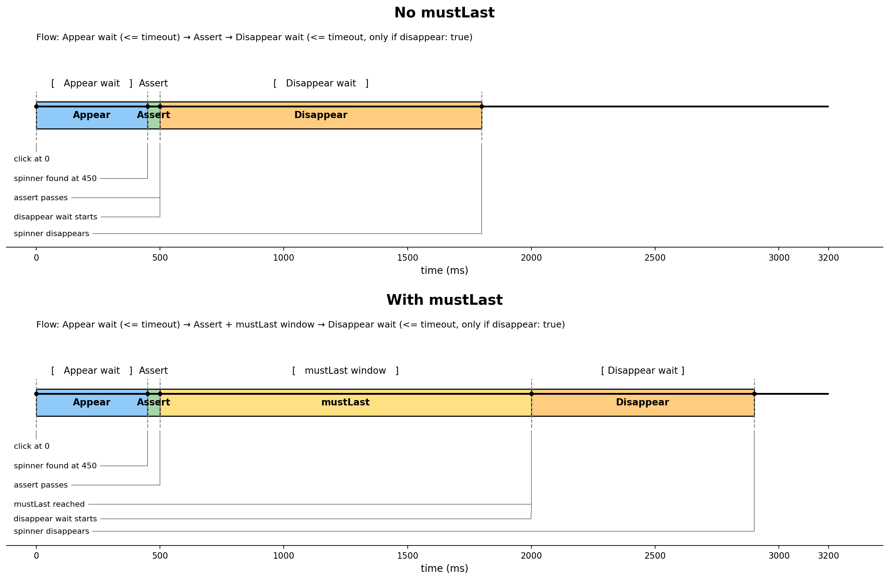

# wick-dom-observer

This plugin adds two Cypress commands to reliably detect UI elements that may appear/disappear quickly: `clickAndWatchForElement` (click + observe) and `watchForElement` (observe only). It supports required/optional appearance, optional disappearance checks, custom timeout/polling, and minimum visible duration (`mustLast`) with a synchronous assertion callback.

This is useful when, for example, a spinner may appear and disappear too quickly for a normal Cypress assertion like:

```js
cy.get('button').click()
cy.get('.spinner').should('exist')
```

## Use Cases

- Validate transient UI feedback such as **spinners**, **toasts**, and **popup panels** that can appear/disappear too quickly for standard Cypress retries.
- Assert save/submit actions trigger visible feedback (spinner, overlay, toast, popup panel) before UI becomes interactive again.
- Reduce flaky tests in fast UIs where micro-loaders or notifications only exist for a few milliseconds.
- Handle optional indicators safely (test passes whether they appear or not), including popup panels that may appear only in specific conditions.
- Enforce that critical indicators appear and optionally disappear within expected timeout windows.
- Verify an element remains visible long enough to be noticeable by users using `mustLast`.

This is especially useful for popup panels that may or may not appear while a page is loading (for example, announcement, or contextual notice panels). With `appear: 'optional'`, you can keep one stable test flow across environments and user states without creating flaky failures when the panel legitimately does not show.

### Examples

- After clicking **Save Profile**, a spinner flashes for ~40ms; `clickAndWatchForElement` still detects it and avoids false negatives.
- Clicking **Generate Report** shows an overlay while the export starts; the test confirms feedback appears before users can click again.
- On page load, an **announcement popup panel** may appear for some users (or not appear at all); `watchForElement` with `appear: 'optional'` keeps the same test stable in both cases.
- On **Delete Item**, a warning badge appears only when related records exist; `appear: 'optional'` lets one test cover both paths.
- After **Pay Now**, a processing indicator must appear and then disappear; `appear: 'required'` + `disappear: true` enforces this.
- During **2FA verification**, a security spinner must remain visible at least 800ms so users notice the transition; `mustLast: 800` validates that UX rule.

## Install

```bash
npm install --save-dev wick-dom-observer
```

## Register the command

In your Cypress support file:

```js
require('wick-dom-observer')
```

## Command API

```js
cy.get(subject).clickAndWatchForElement(config)
cy.get(subject).clickAndWatchForElement(config, options)
cy.get(subject).clickAndWatchForElement(config, position)
cy.get(subject).clickAndWatchForElement(config, position, options)
cy.get(subject).clickAndWatchForElement(config, x, y)
cy.get(subject).clickAndWatchForElement(config, x, y, options)

cy.watchForElement(config)
```

## Config

The `config` argument is mandatory for both `clickAndWatchForElement` and `watchForElement`:

| Option      | Mandatory | Default | Description |
|------------|-----------|---------|-------------|
| `selector` | **Yes**   | —       | CSS selector for the spinner element to poll for. Must be a non-empty string. |
| `assert`   | **Yes**   | —       | **Synchronous callback** `($el) => { ... }` that runs when the spinner is found. Use it to assert on the element (e.g. visibility, class, text). |
| `timeout`  | No        | `Cypress.config('defaultCommandTimeout')` | Max time (ms) to wait for the spinner to appear or disappear. Must be ≥ 0. |
| `appear`   | No        | `'optional'` | `'optional'` — spinner may or may not appear; `'required'` — command fails if the spinner does not appear and satisfy `assert` within `timeout`. |
| `disappear`| No        | `false` | If `true`, after the spinner appears and passes `assert`, the command also waits for it to disappear within `timeout`. |
| `pollingInterval` | No        | `10`    | Polling interval in ms (used for the disappear phase). Must be > 0. |
| `mustLast` | No        | —       | When `appear` is `'required'`, minimum time (ms) the spinner must stay in the DOM. If it is removed before `mustLast` ms, the command fails with an error. Must be ≥ 0 when provided. |

### Relationship between `timeout` and Cypress default timeout

- **Default behavior:** If `config.timeout` is omitted, both commands use Cypress `defaultCommandTimeout` for internal waits.
- **Plugin timeout scope:** `config.timeout` controls the command's internal appear/disappear wait windows.
- **Cypress chain scope:** Cypress still enforces command-chain timeout limits for both:
  - `cy.get(...).clickAndWatchForElement(...)`
  - `cy.watchForElement(...)`

> ⚠️ **Important (`clickAndWatchForElement`)**: setting `{ timeout: ... }` only on the parent `cy.get(...)` does **not** extend the full command flow.
>
> ⚠️ **Important (`watchForElement`)**: there is no parent `cy.get(...)`; the command chain timeout is determined by Cypress command timeout rules and the command's own `config.timeout`.

#### Timeline view



The timeline above maps how timeout values are consumed during the command flow:

1. `cy.get(...)` resolves the subject using Cypress timeout rules.
2. `clickAndWatchForElement(...)` starts observation before click.
3. Click happens.
4. Appear phase runs until spinner is observed (or timeout).
5. Optional disappear phase runs when `disappear: true`.

For `watchForElement(...)`, steps are the same except there is no click step (it starts observing immediately).

Practical rule: keep `defaultCommandTimeout` high enough for the full command chain, and use `config.timeout` to tune element-watch behavior.


> ⚠️ **Recommended setup for longer waits:** set `defaultCommandTimeout` at test (or suite) level for slow spinners/elements testing.


#### Example 1:
`defaultCommandTimeout: 10000`, `appear` not provided (by default `"optional"`) and `disappear` not provided (by default `false`):

```js
it('waits for spinner', { defaultCommandTimeout: 10000 }, () => {
  cy.get('button').clickAndWatchForElement({
    selector: '.spinner',
    timeout: 10000, // plugin internal timeout (can be omitted if same as defaultCommandTimeout)
    assert: ($el) => {
      expect($el).to.be.visible()
    },
  })
})
```

What this test does:

- Sets Cypress command timeout to `10000ms` for this test only.
- Clicks `button`.
- Waits up to `10000ms` for `.spinner` to appear and satisfy `assert`.

Expected result:

- **Passes** if the spinner becomes visible within 10s.
- **Fails** with a clickAndWatchForElement timeout error if spinner does not appear (or does not satisfy `assert`) within 10s.

#### Example 2: 
`defaultCommandTimeout` not provided (by default Cypress.config `defaultCommandTimeout`), `appear:"optional"` and `disappear: false`:

```js
it('handles optional spinner without waiting for disappearance', () => {
  cy.get('[data-cy="save-button"]').clickAndWatchForElement({
    selector: '.loading-spinner',
    timeout: 1000,
    pollingInterval: 10,
    appear: 'optional',
    disappear: false,
    assert: ($el) => {
      expect($el).to.be.visible()
    },
  })
})
```

What this full example does:

- Clicks `[data-cy="save-button"]`.
- Checks for `.loading-spinner`.
- If spinner appears within `1000ms`, it must be visible (`assert`).
- If spinner does not appear, the command still passes because `appear: 'optional'`.
- It does **not** wait for disappearance because `disappear: false`.

Expected result:

- **Passes** when spinner appears and is visible.
- **Also passes** when spinner does not appear at all (optional behavior).
- **Fails** only if spinner appears but does not satisfy `assert` before timeout.

#### Example 3:
Watch an element that may appear on page load (no click action):

```js
it('observes startup banner if it appears', () => {
  cy.visit('/modal-table-demo.html')

  cy.watchForElement({
    selector: '[data-cy="ad-overlay"]',
    appear: 'optional',
    disappear: false,
    timeout: 1500,
    pollingInterval: 10,
    assert: ($el) => {
      expect($el).to.be.visible()
    },
  })
})
```

## Examples

### Basic

```js
cy.get('button').clickAndWatchForElement({
  selector: '.loading-spinner',
  assert: ($el) => {
    expect($el).to.be.visible()
  },
})
```

### Watch only (no click)

```js
cy.watchForElement({
  selector: '.loading-spinner',
  appear: 'optional',
  disappear: false,
  assert: ($el) => {
    expect($el).to.be.visible()
  },
})
```

### Require appearance and disappearance

```js
cy.get('button').clickAndWatchForElement({
  selector: '.loading-spinner',
  timeout: 1000,
  pollingInterval: 10,
  appear: 'required',
  disappear: true,
  assert: ($el) => {
    expect($el).to.be.visible()
    expect($el).to.have.class('loading')
  },
})
```

### Require spinner to stay visible for a minimum time

When `appear` is `'required'`, use `mustLast` to fail if the spinner is removed too soon:

```js
cy.get('button').clickAndWatchForElement({
  selector: '.spinner',
  appear: 'required',
  mustLast: 2000, // spinner must stay in the DOM for at least 2000ms
  assert: ($el) => {
    expect($el).to.be.visible()
  },
})
// If the spinner disappears before 2000ms, the command fails with:
// "spinner was not visible for the minimum time (mustLast: 2000ms). It disappeared after Xms."
```

> ℹ️ **Note on `mustLast` accuracy:** `mustLast` is not an exact millisecond measure; it has a margin of error. This is usually unimportant, since the goal is to assert that the spinner stays visible *long enough for the user to notice*, not to measure duration precisely. Accuracy can be looser when:
> - `mustLast` is very small (e.g. 10–20 ms),
> - `pollingInterval` is large (the check runs every `pollingInterval` ms), or
> - the element is removed from the DOM right around the threshold.
>
> For typical values (e.g. `mustLast` ≥ 50–100 ms and default `pollingInterval`), the check is reliable.

### With click options

```js
cy.get('button').clickAndWatchForElement(
  {
    selector: '.loading-spinner',
    assert: ($el) => {
      expect($el).to.be.visible()
    },
  },
  // Parameters for standard cy.click():
  { force: true }
)
```

### With click position

```js
cy.get('button').clickAndWatchForElement(
  {
    selector: '.loading-spinner',
    assert: ($el) => {
      expect($el).to.be.visible()
    },
  },
  // Parameters for standard cy.click():
  'topRight',
  { force: true }
)
```

### With x/y coordinates

```js
cy.get('canvas').clickAndWatchForElement(
  {
    selector: '.loading-spinner',
    disappear: true,
    assert: ($el) => {
      expect($el).to.be.visible()
    },
  },
  // Parameters for standard cy.click():
  20,
  40,
  { force: true }
)
```


## Command log

The commands add Cypress log entries named `clickAndWatchForElement` or `watchForElement` and update their message to one of:

- `selector observed`
- `selector observed and disappeared`
- `selector not observed (optional)`


## Run the package Cypress examples

This repo includes example tests for the command in `cypress/e2e/clickSpinner.cy.js`, using the demo page `cypress/public/demo.html`.

### Open Cypress UI (interactive)

```bash
npm run cy:open
```

This starts the local static server on port `3030` and opens Cypress.

### Run examples headless

```bash
npm run cy:run
```

This starts the local static server and runs all Cypress specs in headless mode.

### Run only the spinner example spec

```bash
npm run cypress:run -- --spec "cypress/e2e/clickSpinner.cy.js"
```

Useful when you only want to validate `clickAndWatchForElement()` behavior.


## Changelog

### 1.0.0

- Initial release: `cy.clickAndWatchForElement()` custom command for Cypress. 
- Supports detection of elements with mutation observer for reliability, with options for required/optional appearance, custom timeouts, polling interval, `mustLast`, disappearance, and optional click signatures (`clickAndWatchForElement`) or observer-only mode (`watchForElement`).
- Provides flexible config and assert callback for spinner validation.
- Handles very short-lived spinners and prevents test flakiness due to rapid DOM changes.
- Command log integration with meaningful messages on assertion/disappearance.
- **Entirely DOM-based**: does not rely on intercepts, network stubbing, or external synchronization mechanisms.


## Notes

- The `assert` callback must be synchronous.

- Do not put Cypress commands like `cy.wrap()` inside `assert` callback.

- This package is DOM-based and does not depend on intercepted network calls **(FINALLY!!!)**.

- Very small `pollingInterval` values can increase test overhead. `10ms` is supported, but you may prefer `20ms` or `25ms` in many suites.

- If you use a custom `timeout` in config, ensure it is not greater than the Cypress command timeout for that chain, or the test will fail with a Cypress timeout before the command’s internal timeout is used (see [Relationship between `timeout` and Cypress default timeout](#relationship-between-timeout-and-cypress-default-timeout)).

- **Fast spinners:** The command uses a `MutationObserver` to detect when the spinner element is added to the DOM, so very short-lived spinners (e.g. under 60ms) are still detected reliably. **You do not need to increase spinner duration or polling frequency to avoid flakiness.**

- **`mustLast`:** The value is not exact; there is a margin of error (especially for small values like 10–20 ms or when `pollingInterval` is high). The parameter is meant to ensure the spinner is visible long enough to be noticed, not to measure duration precisely. See the note under [Require spinner to stay visible for a minimum time](#require-spinner-to-stay-visible-for-a-minimum-time).


